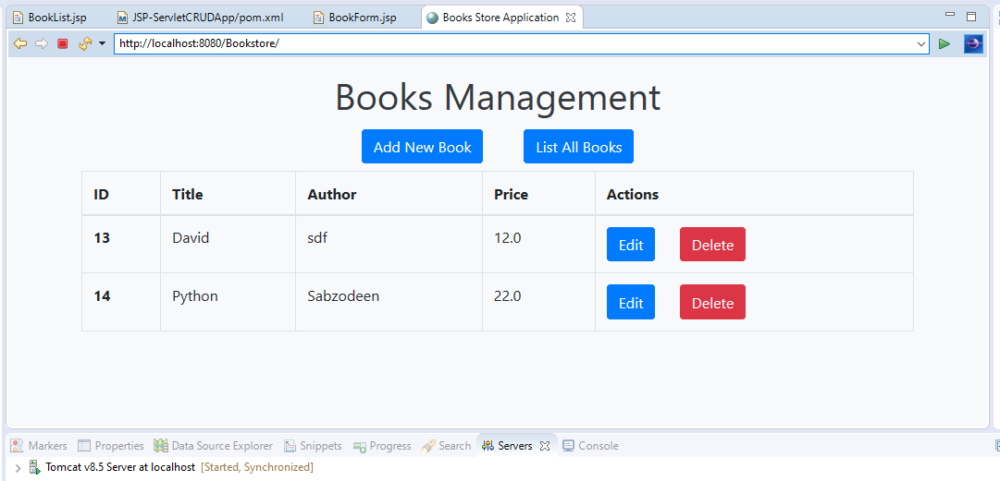

# JSP-Servlet CRUD Application
This CRUD application uses Bootstrap libraries for some UI controls. It carries out a Create, Read, Update and Delete operations on the Database.

Before you deploy this web app, the following sql query shall be run. The application uses MySQL for backend.

```
CREATE DATABASE Bookstore;
USE Bookstore;
 
CREATE TABLE `book` (
  `book_id` int(11) NOT NULL AUTO_INCREMENT,
  `title` varchar(128) NOT NULL,
  `author` varchar(45) NOT NULL,
  `price` float NOT NULL,
  PRIMARY KEY (`book_id`),
  UNIQUE KEY `book_id_UNIQUE` (`book_id`),
  UNIQUE KEY `title_UNIQUE` (`title`)
) ENGINE=InnoDB AUTO_INCREMENT=11 DEFAULT CHARSET=latin1;
```

Following is a screenshot of the CRUD app.

Format: 
